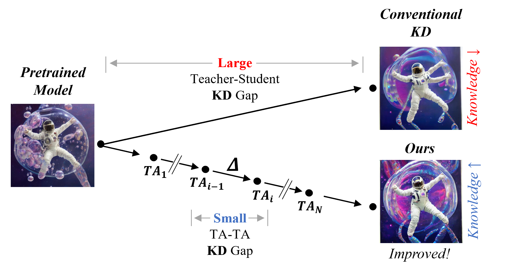
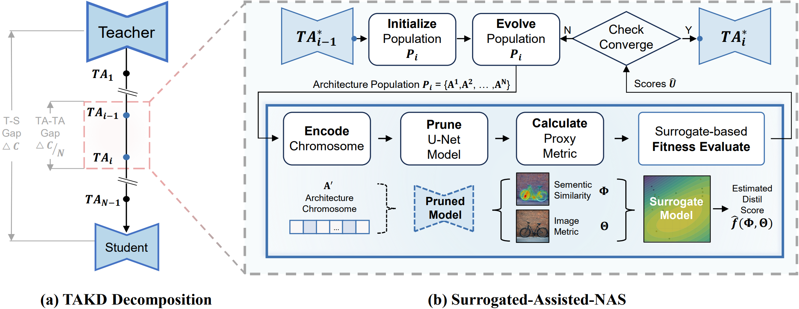

    

        <h2 class="title is-3">Compressing Diffusion Models, One Small Step at a Time</h2>
        

            

                Conventional single-step compression creates a large "knowledge gap," leading to significant performance loss. <strong>DELTA-Diff</strong> bridges this gap by creating an optimal, multi-step distillation path with a series of teacher-assistant models.
            

        

        
        

            <em>Our multi-step approach (bottom) breaks down the large teacher-student knowledge gap into smaller, manageable steps, preserving knowledge far more effectively than conventional single-step methods (top).</em>
        

    

---

    

        <h2 class="title is-4">Abstract</h2>
        

            

                Deploying generative image models on edge devices requires to compress them effectively, but aggressive compression often leads to significant degradation in generation performance. While precedent studies have attempted to mitigate this issue through single-step architectural pruning, they do not address the large capacity gap between the original and compressed models... In this paper, we propose DELTA-Diff, a multi-step knowledge distillation framework designed to resolve this issue.
            

        

    

---

    

        <h2 class="title is-4">How It Works: Surrogate-Assisted Path Optimization</h2>
        

            

                Finding the optimal distillation path is computationally intractable. Our framework transforms this global search into a series of guided local searches. At each stage, a <strong>surrogate-assisted evolutionary search</strong> efficiently finds the best intermediate model architecture, guided by our novel <strong>semantic similarity</strong> metric.
            

            
        

    

---

<h2 class="title is-3 has-text-centered">Results</h2>

    

        <h3 class="title is-4 has-text-centered">Superior Visual Fidelity at High Compression</h3>
        

            At a <strong>63% compression ratio</strong> (-63% U-Net Params), our model (DELTA-Diff Tiny) preserves the teacher's visual quality, while the single-step baseline (BK-SDM) suffers from clear degradation.
        

        
    

    

        <h3 class="title is-4 has-text-centered">Consistent Performance Gains</h3>
        

            DELTA-Diff consistently outperforms the single-step baseline across all compression levels, with the performance gap widening at higher compression ratios.
        

        | Model | U-Net Params | HPS v2 ↑ |
        | :--- | :---: | :---: |
        | Teacher | 860M | 2810 |
        | **Ours (Tiny, -63%)** | **323M** | **2650** |
        | BK-SDM (Tiny, -63%) | 323M | 2601 |
        | **Ours (Small, -44%)** | **483M** | **2691** |
        | BK-SDM (Small, -44%) | 483M | 2662 |
    

    

        <h3 class="title is-4 has-text-centered">Why It Works: Preserving Semantic Representations</h3>
        

            Our method's success comes from preserving the teacher's internal semantic structure. The cross-attention maps of our model show strong alignment with the teacher's, unlike the baseline.
        

        
    

---

    

        <h2 class="title is-4">Citation</h2>
        <code>
<pre>@article{anonymous2026delta,
  title={DELTA-DIFF: Automatic Multi-Step Distillation for Compressing Diffusion Models},
  author={Anonymous},
  journal={Under review},
  year={2026}
}</pre>
        </code>
    

